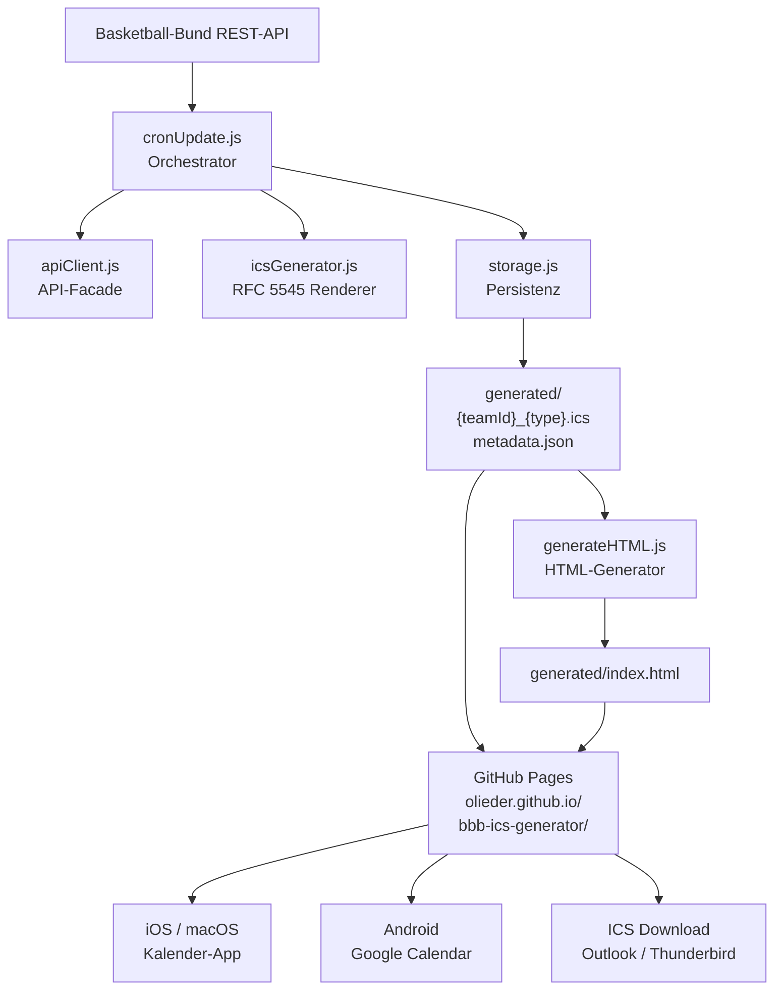

# BBB ICS Generator

Automatischer ICS-Kalender-Generator für die Spielpläne der Fibalon Baskets Neumarkt. Ruft alle 6 Stunden Spieltermine von der Basketball-Bund-API ab und stellt abonnierbare Kalender-Feeds über GitHub Pages bereit.

## Kalender abonnieren

Auf der Übersichtsseite findest du Links für alle Teams und Typen:

**[https://olieder.github.io/bbb-ics-generator/](https://olieder.github.io/bbb-ics-generator/)**

| Plattform | Methode |
|-----------|---------|
| iOS / macOS | Klick auf **iOS/Mac**-Button → öffnet direkt in Kalender.app |
| Android | Klick auf **Android**-Button → öffnet Google Calendar Abonnement-Dialog |
| Andere | Klick auf **ICS Download** → Datei manuell importieren |

Jedes Team bietet drei Varianten: **Alle Spiele**, **Nur Heimspiele**, **Nur Auswärtsspiele**.

## Teams

| Team | Altersgruppe | Team-ID |
|------|-------------|---------|
| Fibalon Baskets Neumarkt | U10 mix | 167881 |
| Fibalon Baskets Neumarkt | U12 mix | 167882 |
| Fibalon Baskets Neumarkt | U14m | 311271 |
| Fibalon Baskets Neumarkt | U16 | 167885 |
| Fibalon Baskets Neumarkt 2 | U16 | 311271 |
| Fibalon Baskets Neumarkt | U20 männlich | 320847 |
| Fibalon Baskets Neumarkt | Senioren männlich | 167889 |
| Fibalon Baskets Neumarkt 2 | Senioren männlich | 167890 |

Die Team-Daten werden automatisch über die Basketball-Bund API ermittelt.

## Datenfluss



## Projektstruktur

```
bbb-ics-generator/
├── src/
│   ├── server.js          # Express-Server (nur für lokale Entwicklung)
│   ├── cronUpdate.js      # Haupt-Update-Skript
│   ├── apiClient.js       # Basketball-Bund API-Client
│   ├── icsGenerator.js    # ICS-Datei-Generierung
│   ├── storage.js         # Datei-I/O
│   └── generateHTML.js    # HTML-Übersichtsseite
├── generated/             # Ausgabeverzeichnis (von GitHub Actions befüllt)
│   ├── index.html
│   ├── metadata.json
│   └── {teamId}_{type}.ics
├── config.json            # Club-ID Konfiguration
└── .github/workflows/     # GitHub Actions
```

## Kalender-Ereignisse

Jedes Spiel wird als ICS-Event angelegt mit:

- **Start:** 1 Stunde vor Anpfiff (Ankunftszeit)
- **Ende:** 2,5 Stunden nach Anpfiff (geschätzte Spieldauer)
- **Titel:** `[HEIM/AUSWÄRTS:] HeimTeam vs. GastTeam (Spiel N)`
- **Beschreibung:** Liga, Saison, Teams, Halle, Adresse, Anpfiffzeit
- **Alarm:** 30 min vorher bei Heimspielen, 60 min bei Auswärtsspielen
- **Ort:** Adresse der Halle

## Automatische Aktualisierung

GitHub Actions führt den Workflow aus bei:
- **Push auf `main`** – sofortiges Update
- **Cron `0 */6 * * *`** – alle 6 Stunden automatisch
- **Manuell** – über das GitHub Actions UI

## Lokale Entwicklung

```bash
npm install

# ICS-Dateien generieren
npm run update

# HTML generieren
npm run generate-html

# Lokalen Server starten (http://localhost:3000)
npm start
```

## Konfiguration

In `config.json` wird nur die Club-ID des Vereins hinterlegt:

```json
{
  "clubId": "4521"
}
```

Teams werden automatisch über die Basketball-Bund API ermittelt und für 30 Tage gecacht. Bei neuen Teams oder Saisonwechseln wird der Cache automatisch nach 30 Tagen erneuert.

## Generierte Dateien

Nach einem Update entstehen im `generated/` Verzeichnis:

- `{teamId}_all.ics` – Alle Spiele
- `{teamId}_home.ics` – Nur Heimspiele
- `{teamId}_away.ics` – Nur Auswärtsspiele
- `metadata.json` – Team-Statistiken und Timestamps
- `index.html` – Übersichtsseite

## Abhängigkeiten

| Paket | Version | Zweck |
|-------|---------|-------|
| axios | ^1.7.9 | HTTP-Client für API-Anfragen |
| ics | ^3.8.1 | RFC 5545 ICS-Generierung |
| express | ^4.21.2 | Lokaler Entwicklungsserver |
| node-cron | ^3.0.3 | Scheduling |
