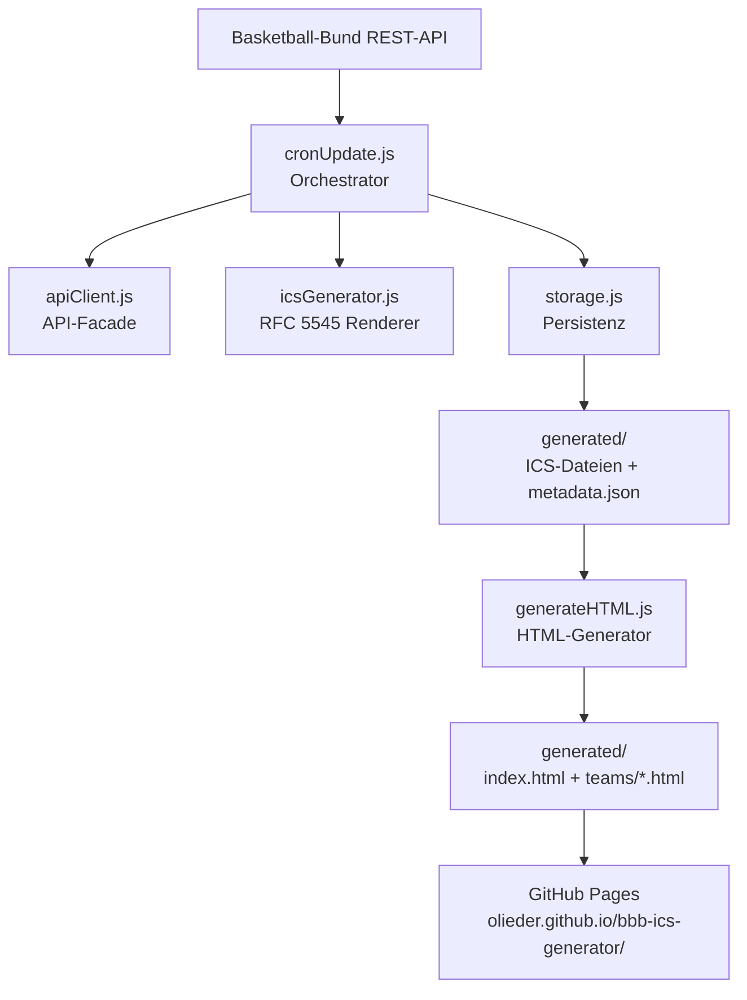

# BBB Vereinsportal

[](https://www.buymeacoffee.com/olivermarcus.eder)

Automatisch generiertes Vereinsportal für die Fibalon Baskets Neumarkt. Ruft alle 6 Stunden Spielplandaten von der Basketball-Bund-API ab und veröffentlicht eine statische Website mit Spielplänen, Tabellen, Turnierbäumen, Team-Seiten und abonnierbaren Kalender-Feeds.

**[https://olieder.github.io/bbb-ics-generator/](https://olieder.github.io/bbb-ics-generator/)**

---

## Features

### Startseite
- Übersicht aller Teams mit Teaser-Karten
- Teaser zeigt adaptiv: bei Saisonbeginn zukünftige Spieltermine, bei laufender Saison letzte Ergebnisse + nächstes Spiel, am Saisonende Hinweis auf Saisonende
- Streak-Anzeige (z.B. "Serie: 3 Siege")
- Navigation mit Hamburger-Menü, sticky Header

### Team-Seiten
- **Next-Game Teaser** — nächstes Spiel mit Datum, Uhrzeit, Gegner, Heim/Auswärts, Hallenname, Adresse, Leaflet-Karte und Navigationslinks zu Google Maps + Apple Maps
- **Tabelle** — offizielle Tabelle + Games-Behind-Variante (NBA-Logik)
- **Turnierklammer** — für Pokalwettbewerbe mit Vorschau zukünftiger Runden
- **Spielplan** — alle/Heim/Auswärts-Tabs mit ICS-Kalender-Links

### Kalender-Abonnement
Jedes Team bietet drei ICS-Feeds:

| Plattform | Methode |
|-----------|---------|
| iOS / macOS | **iOS/Mac**-Button → öffnet direkt in Kalender.app |
| Android | **Android**-Button → Google Calendar Abonnement-Dialog |
| Andere | **ICS Download** → Datei manuell importieren |

Varianten: **Alle Spiele**, **Nur Heimspiele**, **Nur Auswärtsspiele**

---

## Datenfluss



---

## Projektstruktur

```
bbb-ics-generator/
├── src/
│   ├── server.js          # Express-Server (lokale Entwicklung)
│   ├── cronUpdate.js      # Haupt-Update-Skript (API → ICS + metadata.json)
│   ├── apiClient.js       # Basketball-Bund API-Client
│   ├── icsGenerator.js    # ICS-Datei-Generierung (RFC 5545)
│   ├── storage.js         # Datei-I/O und Teams-Cache
│   └── generateHTML.js    # Statischer HTML-Generator
├── generated/             # Ausgabeverzeichnis (von GitHub Actions befüllt)
│   ├── index.html         # Startseite mit Team-Teasern
│   ├── metadata.json      # Team-Metadaten, Spielplandaten, Tabellen
│   ├── teams/             # Individuelle Team-Seiten
│   │   └── {teamId}.html
│   └── {teamId}_{type}.ics
├── tests/
│   └── e2e/               # End-to-End Tests (node:test)
├── config.json            # Vereinskonfiguration (clubId, Theme)
└── .github/workflows/     # GitHub Actions (automatisches Update alle 6h)
```

---

## Konfiguration

`config.json` definiert den Verein und optionales Theming:

```json
{
  "clubId": "4521",
  "theme": {
    "primary": "#004174",
    "accent":  "#009ef3",
    "logoUrl": null
  },
  "cupColor": "#7c3aed"
}
```

Teams werden automatisch über die Basketball-Bund API ermittelt und für 30 Tage gecacht. Der Cache erneuert sich nach 30 Tagen automatisch.

---

## Kalender-Ereignisse (ICS)

Jedes Spiel wird als ICS-Event angelegt mit:

- **Start:** 1 Stunde vor Anpfiff (Ankunftszeit)
- **Ende:** 2,5 Stunden nach Anpfiff (geschätzte Spieldauer)
- **Titel:** `[H/A] HeimTeam vs. GastTeam`
- **Beschreibung:** Liga, Teams, Halle, Adresse, Anpfiffzeit
- **Alarm:** 30 min vorher (Heim), 60 min vorher (Auswärts)
- **Ort:** Adresse der Spielhalle

---

## Next-Game Teaser (Teamseiten)

Jede Teamseite zeigt oben einen Teaser für das nächste Spiel.

- **Kartendienst:** [Leaflet.js](https://leafletjs.com/) + [OpenStreetMap](https://www.openstreetmap.org/) (kein API-Key nötig)
- **Geocoding:** [Nominatim](https://nominatim.openstreetmap.org/) — clientseitig, 1 Anfrage pro Seitenaufruf (Nutzungsbedingungen beachten)
- **Navigation:** Links zu Google Maps und Apple Maps mit vorausgefüllter Zieladresse
- **Kein nächstes Spiel:** Hinweis "Aktuell sind keine weiteren Spiele geplant."

---

## Automatische Aktualisierung

GitHub Actions aktualisiert die Seite:
- **Push auf `main`** — sofortiges Update
- **Cron `0 */6 * * *`** — alle 6 Stunden
- **Manuell** — über das GitHub Actions UI

---

## Lokale Entwicklung

```bash
npm install

# Alle Daten von der API laden und ICS + metadata.json generieren
npm run update

# HTML aus metadata.json generieren (ohne API-Aufruf)
npm run generate-html

# Lokalen Server starten (http://localhost:3000)
npm start

# Tests ausführen
npm test
```

---

## Abhängigkeiten

| Paket | Version | Zweck |
|-------|---------|-------|
| axios | ^1.7.9 | HTTP-Client für API-Anfragen |
| ics | ^3.8.1 | RFC 5545 ICS-Generierung |
| express | ^4.21.2 | Lokaler Entwicklungsserver |
| node-cron | ^3.0.3 | Scheduling |
