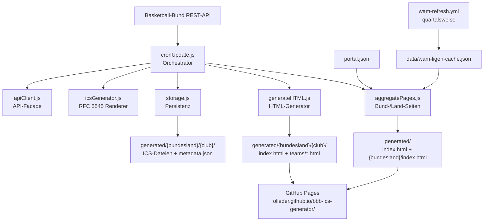

# BBB Vereinsportal

[](https://www.buymeacoffee.com/olivermarcus.eder)

Automatisch generiertes Vereinsportal für die Fibalon Baskets Neumarkt. Ruft alle 6 Stunden Spielplandaten von der Basketball-Bund-API ab und veröffentlicht eine statische Website mit Spielplänen, Tabellen, Turnierbäumen, Team-Seiten und abonnierbaren Kalender-Feeds.

**[https://olieder.github.io/bbb-ics-generator/](https://olieder.github.io/bbb-ics-generator/)**

---

## Features

### Bund-/Land-Navigation
- **Bund-Startseite** (`generated/index.html`) mit allen Bundesländern eingebundener Vereine, ergänzt um den Block „Bundesweite Wettbewerbe“ für Vereine, deren Teams nur in bundesweiten Ligen spielen
- **Land-Seiten** (`generated/<bundesland>/index.html`) mit den Ligatabellen der eingebundenen Vereine; jede Liga erscheint nur einmal (dedupliziert über die `ligaId`), Tabellenzeilen eingebundener Vereine sind hervorgehoben und verlinkt. Mit WAM-Cache sind die Ligen nach Verbands-, Bezirks- und Kreisebene gruppiert
- **Migrationsbanner** auf der Bund-Seite, wenn mindestens ein Verein `legacyRootOutput: true` gesetzt hat
- **Portal-Rechtsseiten** (Impressum, Datenschutz, Barrierefreiheit) des Portal-Betreibers unter `generated/`

### Vereins-Startseite
- Übersicht aller Teams mit Teaser-Karten
- Teaser zeigt adaptiv: bei Saisonbeginn zukünftige Spieltermine, bei laufender Saison letzte Ergebnisse + nächstes Spiel, am Saisonende Hinweis auf Saisonende
- Streak-Anzeige (z.B. "Serie: 3 Siege")
- Navigation mit Hamburger-Menü, sticky Header

### Team-Seiten
- **Next-Game Teaser** — nächstes Spiel mit Datum, Uhrzeit, Gegner, Heim/Auswärts, Hallenname, Adresse, Leaflet-Karte und Navigationslinks zu Google Maps + Apple Maps
- **Tabelle** — offizielle Tabelle + Games-Behind-Variante (NBA-Logik)
- **Turnierklammer** — für Pokalwettbewerbe mit Vorschau zukünftiger Runden
- **Spielplan** — alle/Heim/Auswärts-Tabs mit ICS-Kalender-Links

### Kalender-Abonnement
Jedes Team bietet drei ICS-Feeds:

| Plattform | Methode |
|-----------|---------|
| iOS / macOS | **iOS/Mac**-Button → öffnet direkt in Kalender.app |
| Android | **Android**-Button → Google Calendar Abonnement-Dialog |
| Andere | **ICS Download** → Datei manuell importieren |

Varianten: **Alle Spiele**, **Nur Heimspiele**, **Nur Auswärtsspiele**

---

## Datenfluss


```mermaid
flowchart TD
    API["Basketball-Bund REST-API"] --> CU["cronUpdate.js\nOrchestrator"]
    CU --> AC["apiClient.js\nAPI-Facade"]
    CU --> IG["icsGenerator.js\nRFC 5545 Renderer"]
    CU --> ST["storage.js\nPersistenz"]
    ST --> GEN["generated/{bundesland}/{club}/\nICS-Dateien + metadata.json"]
    CU --> GH["generateHTML.js\nHTML-Generator"]
    GH --> HTML["generated/{bundesland}/{club}/\nindex.html + teams/*.html"]
    CU --> AP["aggregatePages.js\nBund-/Land-Seiten"]
    PJ["portal.json"] --> AP
    WAM["data/wam-ligen-cache.json"] --> AP
    AP --> PORTAL["generated/\nindex.html + {bundesland}/index.html"]
    WR["wam-refresh.yml\nquartalsweise"] --> WAM
    HTML --> GP["GitHub Pages\nolieder.github.io/bbb-ics-generator/"]
    PORTAL --> GP
```

---

## Projektstruktur

```
bbb-ics-generator/
├── src/
│   ├── server.js          # Express-Server (lokale Entwicklung)
│   ├── cronUpdate.js      # Multi-Club-Orchestrator (API → ICS + metadata.json + HTML, pro Club; danach Aggregation)
│   ├── aggregatePages.js  # Bund-/Land-Seiten und Portal-Legal-Seiten aus den Club-Ergebnissen
│   ├── wamClient.js       # WAM-Liga-Abruf (paginiert)
│   ├── wamCache.js        # Laden/TTL/Index/Refresh des WAM-Liga-Caches
│   ├── portalConfig.js    # Lädt und validiert portal.json (Betreiberangaben)
│   ├── clubs.js           # Lädt clubs/<bundesland>/<club>/config.json rekursiv
│   ├── verbandMapping.js  # verbandId → Bundesland-Zuordnung + Mehrheitsvotum pro Club
│   ├── apiClient.js       # Basketball-Bund API-Client (inkl. mapWithConcurrency-Helfer)
│   ├── icsGenerator.js    # ICS-Datei-Generierung (RFC 5545)
│   ├── storage.js         # Datei-I/O, Teams-Cache, Slug-Validierung (Path-Traversal-Schutz)
│   └── generateHTML.js    # Statischer HTML-Generator (pro Club aufgerufen)
├── scripts/
│   └── refresh-wam-cache.js   # CLI: aktualisiert data/wam-ligen-cache.json (npm run wam:refresh)
├── data/
│   └── wam-ligen-cache.json   # Versionierter WAM-Liga-Cache (quartalsweise aktualisiert)
├── portal.example.json    # Vorlage für portal.json (Betreiberangaben des Portals)
├── clubs/                 # Ein Verzeichnis pro Bundesland/Club
│   └── bayern/
│       └── fibalon/
│           └── config.json    # Vereinskonfiguration (clubId, Theme, legal, legacyRootOutput)
├── generated/              # Ausgabeverzeichnis (von GitHub Actions befüllt)
│   ├── index.html                # Bund-Startseite
│   ├── {impressum,datenschutz,barrierefreiheit}.html   # Portal-Rechtsseiten
│   ├── bayern/
│   │   ├── index.html          # Land-Seite (Ligatabellen der eingebundenen Vereine)
│   │   └── fibalon/
│   │       ├── index.html      # Startseite mit Team-Teasern
│   │       ├── metadata.json   # Team-Metadaten, Spielplandaten, Tabellen
│   │       ├── teams/          # Individuelle Team-Seiten
│   │       │   └── {teamId}.html
│   │       └── {teamId}_{type}.ics
│   └── {teamId}_{type}.ics       # Alt-Pfad-Duplikat (nur ICS) für Clubs mit legacyRootOutput: true (siehe ADR-013/ADR-020 in docs/arc42)
├── tests/
│   └── e2e/               # End-to-End Tests (node:test)
└── .github/workflows/     # GitHub Actions (automatisches Update alle 6h)
```

---

## Konfiguration

Jeder Verein bekommt ein eigenes Verzeichnis unter `clubs/<bundesland-slug>/<club-slug>/config.json`. Der Ordnername (`<bundesland-slug>`) ist dabei nur eine Organisationshilfe im Repository — welches Bundesland tatsächlich für die Ausgabe-URL verwendet wird, ermittelt `cronUpdate.js` bei jedem Lauf automatisch aus den echten Liga-Daten der Teams (siehe `src/verbandMapping.js`).

Beispiel (illustrativ, angelehnt an `clubs/bayern/fibalon/config.json`):

```json
{
  "clubId": "4468",
  "legacyRootOutput": false,
  "theme": {
    "primary": "#004174",
    "accent": "#009ef3",
    "logoUrl": "https://example.com/logo.png"
  },
  "cupColor": "#7c3aed",
  "legal": {
    "operator": "Musterverein Beispielstadt e.V.",
    "address": "Musterstraße 1, 92318 Beispielstadt",
    "email": "",
    "phone": "",
    "responsible": ""
  },
  "onboarding": {
    "status": "pending"
  }
}
```

- `clubId` (Pflichtfeld) — die Basketball-Bund-Vereins-ID.
- `theme` (optional) — `primary`/`accent`/`logoUrl` überschreiben das Standard-Theme. **Wichtig:** Der Schlüssel muss exakt `theme` heißen — `cronUpdate.js` liest `club.config.theme`; ein anderer Schlüsselname (z.B. `_theme_example`) wird stillschweigend ignoriert und das Standard-Theme greift.
- `cupColor` (optional) — Akzentfarbe für Pokalwettbewerbe.
- `name` (optional) — Anzeigename des Vereins auf den Portal-Seiten (Bund-/Land-Seiten); Fallback ist `legal.operator`, dann der Ordnername.
- `legal` (optional) — steuert Footer-Links und rechtliche Pflichtseiten (siehe unten).
- `legacyRootOutput` (optional, `true`/`false`) — nur für Vereine, die bereits vor dem Multi-Club-Umbau unter dem alten, flachen Pfad (`generated/{teamId}_{type}.ics`) liefen und bestehende Kalender-Abos haben. Erzeugt zusätzlich zur neuen, verschachtelten Ausgabe ein ICS-Duplikat am alten Pfad, inklusive Migrationshinweis im Kalender; die Bund-Seite zeigt dann einen Migrationsbanner. Neue Vereine setzen dieses Feld nicht.
- `onboarding` (optional, informativ) — `status`-Feld zur manuellen Nachverfolgung des Onboarding-Fortschritts eines Clubs, aktuell die Werte `"pending"` oder `"confirmed"`. Wird von keinem Modul ausgewertet (kein Code liest dieses Feld) — reine Organisationshilfe für die Betreiber, vergleichbar mit dem Bundesland-Ordnernamen im Quellbaum.

Das `legal`-Objekt steuert Footer-Links und rechtliche Pflichtseiten:
- Alle Felder sind optionale Strings.
- `datenschutz.html` und `barrierefreiheit.html` werden immer generiert.
- `impressum.html` und der Impressum-Footer-Link werden **nur** generiert, wenn mindestens ein Feld in `legal` nicht leer ist.
- Ist `legal` vollständig absent oder alle Felder leer, entfällt der Impressum-Link im Footer.

Teams werden automatisch über die Basketball-Bund API ermittelt und für 30 Tage gecacht. Der Cache erneuert sich nach 30 Tagen automatisch.

### Portal-Betreiberangaben (portal.json)

Die Bund-/Land-Seiten und die Portal-Rechtsseiten brauchen die Angaben des Portal-Betreibers. Die Datei `portal.json` im Repo-Root wird vom Betreiber selbst angelegt: `portal.example.json` nach `portal.json` kopieren und ausfüllen.

- `operator`, `address`, `email` — Pflichtfelder
- `phone`, `responsible` — optional

**Deploy-Voraussetzung:** `portal.json` (mit den Betreiberangaben) muss im Repo-Root liegen, bevor nach `main` gemergt wird; sonst deployt `deploy.yml` ohne Bund-/Land-Seiten und der Job wird rot.

Ohne gültige `portal.json` (Datei fehlt, Pflichtfeld leer) werden keine Bund-/Land-Seiten erzeugt und der Update-Lauf endet mit Fehler; die Ausgabe der einzelnen Vereine und die ICS-Dateien bleiben davon unberührt. Über die Umgebungsvariable `BBB_PORTAL_CONFIG` kann ein anderer Pfad angegeben werden.

### WAM-Liga-Cache

`npm run wam:refresh` aktualisiert `data/wam-ligen-cache.json` für alle Bundesländer der Vereine unter `clubs/` (abgeleitet aus dem Ordnernamen `clubs/<bundesland>/…`; `bundesweit` wird übersprungen). Der Cache liefert die Ebenen-Zuordnung (Verband/Bezirk/Kreis) für die Gruppierung der Land-Seiten. Der Workflow `wam-refresh.yml` läuft quartalsweise und lässt sich manuell über `workflow_dispatch` starten; wurde ein Verband nur unvollständig abgerufen, endet er mit Fehler und committet nichts. Ohne Cache (oder wenn er älter als 150 Tage ist) funktioniert alles weiter, nur ohne Gruppierung nach Ebene.

### Migration vom alten Fibalon-Pfad

Die HTML-Seiten am alten Fibalon-Pfad entfallen. Die alten Kalender-URLs (`/{teamId}_{typ}.ics`) bleiben bestehen.

---

## Kalender-Ereignisse (ICS)

Jedes Spiel wird als ICS-Event angelegt mit:

- **Start:** 1 Stunde vor Anpfiff (Ankunftszeit)
- **Ende:** 2,5 Stunden nach Anpfiff (geschätzte Spieldauer)
- **Titel:** `[H/A] HeimTeam vs. GastTeam`
- **Beschreibung:** Liga, Teams, Halle, Adresse, Anpfiffzeit
- **Alarm:** 30 min vorher (Heim), 60 min vorher (Auswärts)
- **Ort:** Adresse der Spielhalle

---

## Next-Game Teaser (Teamseiten)

Jede Teamseite zeigt oben einen Teaser für das nächste Spiel.

- **Kartendienst:** [Leaflet.js](https://leafletjs.com/) + [OpenStreetMap](https://www.openstreetmap.org/) (kein API-Key nötig)
- **Geocoding:** [Nominatim](https://nominatim.openstreetmap.org/) — clientseitig, 1 Anfrage pro Seitenaufruf (Nutzungsbedingungen beachten)
- **Navigation:** Links zu Google Maps und Apple Maps mit vorausgefüllter Zieladresse
- **Kein nächstes Spiel:** Hinweis "Aktuell sind keine weiteren Spiele geplant."

---

## Automatische Aktualisierung

GitHub Actions aktualisiert die Seite:
- **Push auf `main`** — sofortiges Update
- **Cron `0 */6 * * *`** — alle 6 Stunden
- **Manuell** — über das GitHub Actions UI

Schlägt die Verarbeitung einzelner Vereine fehl, deployt `deploy.yml` trotzdem die übrigen (sofern mindestens eine ICS-Datei erzeugt wurde) und markiert den Job am Ende als fehlgeschlagen. Der WAM-Liga-Cache wird separat durch `wam-refresh.yml` quartalsweise aktualisiert.

---

## Lokale Entwicklung

```bash
npm install

# Alle Daten von der API laden und ICS + metadata.json + HTML generieren
# (pro Club aus clubs/<bundesland>/<club-slug>/config.json; genHTML() wird intern aufgerufen)
npm run update

# Lokalen Server starten (http://localhost:3000)
npm start

# WAM-Liga-Cache aktualisieren (data/wam-ligen-cache.json)
npm run wam:refresh

# Tests ausführen
npm test
```

---

## Abhängigkeiten

| Paket | Version | Zweck |
|-------|---------|-------|
| axios | ^1.7.9 | HTTP-Client für API-Anfragen |
| ics | ^3.8.1 | RFC 5545 ICS-Generierung |
| express | ^4.21.2 | Lokaler Entwicklungsserver |
| node-cron | ^3.0.3 | Scheduling |
